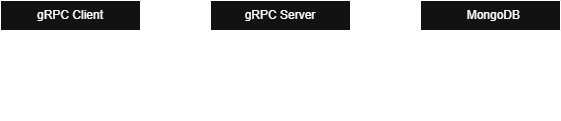

# gRPC User Management Service

## 1. Setup

### Prerequisites

* Go 1.20+
* Docker 

## Architecture



### Step 1: Clone and Install

```bash
git clone https://github.com/neung2542/go-gRPC-authService.git
cd go-gRPC
go mod tidy
```

### Step 2: Start MongoDB via Docker Compose

```bash
docker-compose up -d
```

### Step 3: Run the gRPC Server

```bash
go run main.go
```

### Step 4: Test API using Postman or grpcurl

#### Test with Postman (gRPC tab)

1. Open Postman.
2. **New > gRPC Request**.
3. Import `proto/user.proto`.
4. Set the server address to `localhost:50051`.
5. Call `AuthService > Register`, and pass the request body:

```json
{
  "email": "user@example.com",
  "password": "123456Aaa@"
}
```

6. Call `AuthService > Login`, and copy the returned token.
7. Call `AuthService > Logout`, and pass:

```json
{
  "token": "<paste_token_here>"
}
```
In Authorization Add Bearer Token

```bash
Bearer "<paste_token_here>"
```

## 2. API Documentation

### AuthService

```proto
service AuthService {
  rpc Login(LoginRequest) returns (LoginResponse);
  rpc Logout(LogoutRequest) returns (LogoutResponse);
  rpc Register(RegisterRequest) returns (RegisterResponse);
}

message User {
  string id = 1;
  string email = 2;
  string name = 3;
  google.protobuf.Timestamp created_at = 4;
  google.protobuf.Timestamp updated_at = 5;
  bool is_active = 6;
  bool is_deleted = 7;
}

// Authentication messages
message LoginRequest {
  string email = 1;
  string password = 2;
}

message LoginResponse {
  string token = 1;
  User user = 2;
  string message = 3;
}

message LogoutRequest {
  string token = 1;
}

message LogoutResponse {
  string message = 1;
}

message RegisterRequest {
  string email = 1;
  string password = 2;
  string name = 3;
}

message RegisterResponse {
  User user = 1;
  string message = 2;
}
```

### UserService

```proto
service UserService {
  rpc GetProfile(GetProfileRequest) returns (GetProfileResponse);
  rpc UpdateProfile(UpdateProfileRequest) returns (UpdateProfileResponse);
  rpc DeleteProfile(DeleteProfileRequest) returns (DeleteProfileResponse);
  rpc ListUsers(ListUsersRequest) returns (ListUsersResponse);
  rpc ChangePassword(ChangePasswordRequest) returns (ChangePasswordResponse);
}

message GetProfileRequest {
  string user_id = 1;
}

message GetProfileResponse {
  User user = 1;
}

message UpdateProfileRequest {
  string user_id = 1;
  string name = 2;
  string email = 3;
}

message UpdateProfileResponse {
  User user = 1;
  string message = 2;
}

message DeleteProfileRequest {
  string user_id = 1;
}

message DeleteProfileResponse {
  string message = 1;
}

message ListUsersRequest {
  int32 page = 1;
  int32 page_size = 2;
  string name_filter = 3;
  string email_filter = 4;
}

message ListUsersResponse {
  repeated User users = 1;
  int32 total_count = 2;
  int32 page = 3;
  int32 page_size = 4;
}
```

---

### TO ADD FEATURE

1. **NAME/EMAIL FILTER**: filter name/email in ListUsersRequest
2. **RESET PASSWORD**: able to reset password and Generate/validate reset tokens

